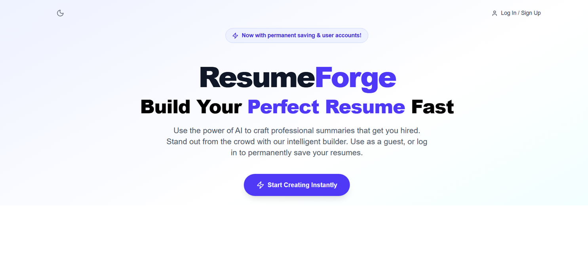
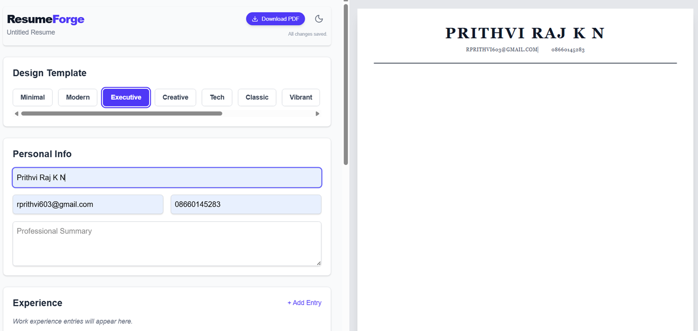
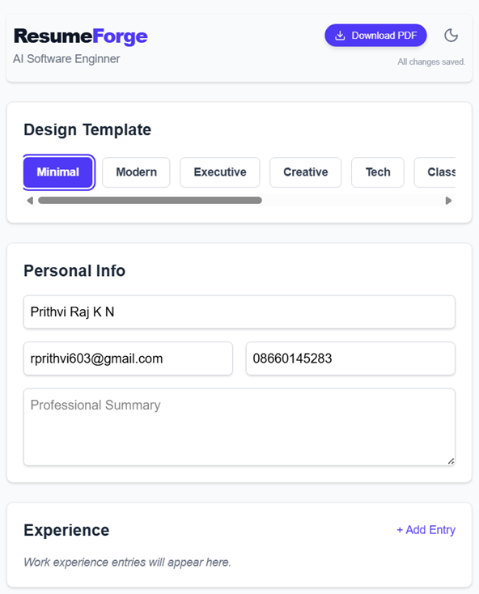
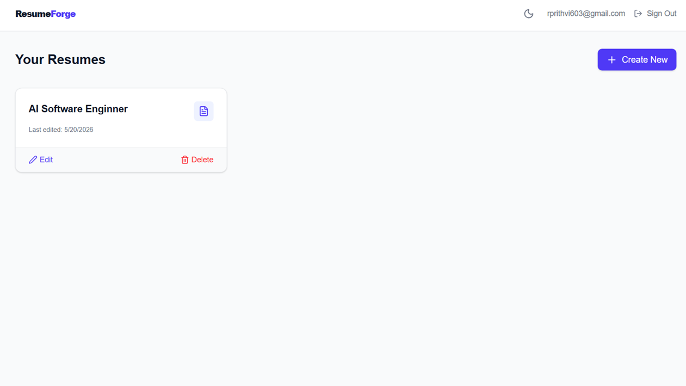

# 🚀 ResumeForge - AI-Powered Resume Builder

Build Your Perfect Resume Fast! ResumeForge uses the power of AI to craft professional summaries and bullet points that get you hired. Stand out from the crowd with our intelligent builder.



*(**Note to developer**: Please capture a screenshot of your homepage and save it to `public/screenshots/hero.png`)*

## ✨ Features

- **🤖 AI-Powered Enhancement**: Instantly generate professional summaries and polish your entire resume with advanced AI (Powered by OpenRouter & GPT-OSS).
- **🎨 10+ Premium Templates**: Switch between beautiful, ATS-friendly designs (Minimal, Modern, Executive, Creative, Tech, Classic, Vibrant, Elegant, Startup, Academic) in real-time.
- **🔐 Secure Authentication**: Fast login via Email/Password or **Google OAuth** powered by Supabase Auth.
- **💾 Permanent Storage**: Save your progress across devices automatically.
- **📱 Fully Responsive**: A seamless mobile experience with a dedicated toggle between the "Edit Details" form and the "Preview Design" canvas.
- **🌙 Dark Mode Support**: System-aware dark mode toggle across the entire application.
- **🛡️ Admin Dashboard**: Restricted dashboard for viewing platform analytics and secure user management.
- **📄 Instant PDF Export**: Instantly generate and download your resume as a high-quality PDF.

## 📸 Screenshots

| Builder Interface | Mobile View | Admin Dashboard |
|:---:|:---:|:---:|
|  |  |  |

*(**Note to developer**: Add screenshots named `builder.png`, `mobile.png`, and `admin.png` to the `public/screenshots/` folder to display them properly)*

---

## 🛠️ Technology Stack

- **Frontend**: [Next.js](https://nextjs.org/) (App Router, Turbopack)
- **Styling**: [Tailwind CSS v4](https://tailwindcss.com/)
- **Backend & Auth**: [Supabase](https://supabase.com/) (PostgreSQL + Row Level Security + Google OAuth)
- **AI Integration**: [Vercel AI SDK](https://sdk.vercel.ai/) & OpenRouter (`openai/gpt-oss-20b:free`)
- **Icons**: [Lucide React](https://lucide.dev/)

---

## 🚀 Getting Started

Follow these steps to set up the project on your local machine and make it your own!

### 1. Clone the repository
```bash
git clone https://github.com/CyberScythe1/AI-Resume-builder.git
cd ai_resume_maker
```

### 2. Install dependencies
```bash
npm install
```

### 3. Set up Supabase
1. Create a new project on [Supabase](https://supabase.com/).
2. Open the **SQL Editor** in your Supabase dashboard and run the entire script found in `supabase_schema_final.sql`. 
   > This script will automatically create the `resumes` table, `user_roles` table, enable Row Level Security, and configure the necessary Postgres RPC functions for your admin dashboard.
3. In the **Authentication > Providers** settings, enable **Google** and provide your Google Cloud Console Client ID and Secret to allow users to sign in with Google.

### 4. Configure Environment Variables
Create a `.env.local` file in the root of the project with your API keys:
```env
# Supabase Configuration
NEXT_PUBLIC_SUPABASE_URL=your_supabase_project_url
NEXT_PUBLIC_SUPABASE_ANON_KEY=your_supabase_anon_key

# OpenRouter Configuration (for AI features)
OPENROUTER_API_KEY=your_openrouter_api_key
```

### 5. Run the Development Server
```bash
npm run dev
```
The application will be available at `http://localhost:3000`.

---

## 🛡️ Admin Panel Setup

By default, the `/admin` route is restricted. To grant yourself Admin privileges:
1. Log into your app once using your email or Google OAuth so your user is registered.
2. Go to your Supabase **Table Editor**.
3. Locate your User ID in the `auth.users` schema.
4. Insert a new row into the `public.user_roles` table mapping your `user_id` to the role `'admin'`.

Now, if you navigate to `/admin`, you will securely see total app metrics and have the ability to manage users.

---

## 📜 License
This project is licensed under the MIT License. Feel free to fork, modify, and build upon it!
